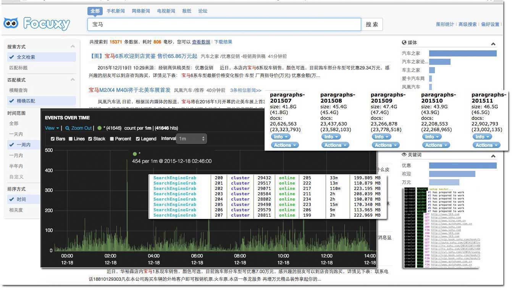

spider2 [](http://badge.fury.io/js/spider2)
=========

A 2nd generation spider to crawl any article site, automatic reading title and content.
# Performance
In my case, the speed of [spider](https://github.com/Tjatse/spider2) is about **700 thousands documents per day**, **22 million per month**, and the maximize crawling speed is **450 per minute**, **avg 80 per minute**, the memory cost are about **200 megabytes** on each spider kernel, and the accuracy is about 90%, the rest 10% can be fixed by customizing [Score Rules](#score_rule) or [Selectors](selectors). it's better than any other readability modules.



> Server infos: 
> * 20M bandwidth of fibre-optical
> * 8 Intel(R) Xeon(R) CPU E5-2650 v2 @ 2.60GHz cpus
> * 32G memory

# Features
## Multi-core crawling
It is not a single spider runs in a single thread. To take advantage of multi-core systems we maybe wanna launch
a cluster of processes to handle the load, this is exactly what `spider2` does - Crawling fast and in order to
maximum performance.

## Concurrency
**Multi-core crawling** feature is just make spiders work in a fork mode, but concurrency makes them work together in a
same thread and at a same time!!!

## Automatic
The old school crawls links/articles in a manual mode, e.g.: *request to server and get the response(HTML), then using
jQuery or something else to analyze links/articles by hard code*, this feels sucks, currently, we just need to make a list
of websites that you wanna scrape, `spider2` will handle anything else, take a cup of coffee, and wait to harvest the fruit.

## Queue
All the jobs are managed by async queue, so you can keep pushing the urls which to be crawled/read.

## More features
- Automatic User-Agent (actually I am a browser, not a spider).
- Proxy supports (avoid being blocked by server).
- Blazing fast with Cheerio & Cluster Fork Mode.
- Automatic Decode encodings (especially useful with non-english language).
- ...

# Installation
```
npm install spider2 --production
```

# Programmatic
## Require
```javascript
var Spider = require('spider2');
```

## Usage
```javascript
var spider = Spider({
  timeout: 5000,
  debug: true,
  domain: true,
  workers: 7,
  concurrency: 1
});
```
### Options
The options including:
- **timeout** Set a timeout (in milliseconds) for the request, `10000` by default.
- **debug** A value indicating whether show the debug log or not, `false` by default, also it could be set with `process.env.SP_DEBUG`.
- **domain** A value indicating whether the links being crawled should in a same domain with the base url or not, `true` by default.
- **workers** Number of multi-core, can not greater than number of CPUs.
- **concurrency** number of concurrency per worker, `1` by default.

### Events
#### error
This event is emitted when an error has been caught, the arguments including:
- `err` Error object
- `req` Request data, if `req.worker` is defined an it is a number, means error is from the worker, `req.worker` is the id of a worker, otherwise it is a normal error.
Example:
```javascript
spider.on('error', function (err, req) {
  if (req.worker) {
    console.error('worker #', req.worker, 'has an error:', err.message);
  } else {
    console.error(req.uri, err.message);
  }
});
```

#### data
Data send by spider are obtained using this event, arguments including:
- `req` Request data.
- `res` Response data, if `req._type` equals `Spider.type.LINK`, `res` should be an array, including key-value pairs like `{title: [ANCHOR_TITLE], uri: [ANCHOR_HREF]}`, and if equals `Spider.type.ARTICLE`, `res` should be an object, keys including `title` and `content`.
Example:
```javascript
spider.on('data', function (req, res) {
  if (req._type == Spider.type.LINK) {
    spider.read(_.filter(res, validLink));
  } else if (req._type == Spider.type.ARTICLE) {
    console.log(req.uri, res.title);
  }
});
```

#### end
This event is emitted after all the spiders terminated abnormally, e.g.:
```javascript
spider.on('end', function () {
  console.log('[END]');
});
```

### Methods
#### crawl
Crawl links, `OPTION` could be one of below:
- **String** Url
- **Array** Array of urls, both `[String, String, ...]` and `[Object, Object, ...]` will be fine.
- **Object** Must including `uri` property.

e.g.:
```javascript
spider.crawl([OPTION]);
```

#### read
Read title and content of article, `OPTION` is same as above, e.g.:
```javascript
spider.read([OPTION]);
```

#### destroy
Peaceful quit, e.g.:
```javascript
spider.destroy();
```

#### ping
Ping the spider and returns workers' status Array, e.g.:
```javascript
var pong = spider.ping();
console.log(pong);
```

`pong` will be printed like:
```
[
  {id: 1, count: 12},
  {id: 2, count: 90},
  ...
]
```

`id` is the id of worker, and `count` is the count of remaining jobs.

# Test
```
npm test
```

# Examples
Head over to `test/` or `/examples` directory.

# TODO
- [ ] fix typo bug
- [ ] more tests

# License
Copyright 2014 Tjatse

Licensed under the Apache License, Version 2.0 (the "License");
you may not use this file except in compliance with the License.
You may obtain a copy of the License at

    http://www.apache.org/licenses/LICENSE-2.0

Unless required by applicable law or agreed to in writing, software
distributed under the License is distributed on an "AS IS" BASIS,
WITHOUT WARRANTIES OR CONDITIONS OF ANY KIND, either express or implied.
See the License for the specific language governing permissions and
limitations under the License.